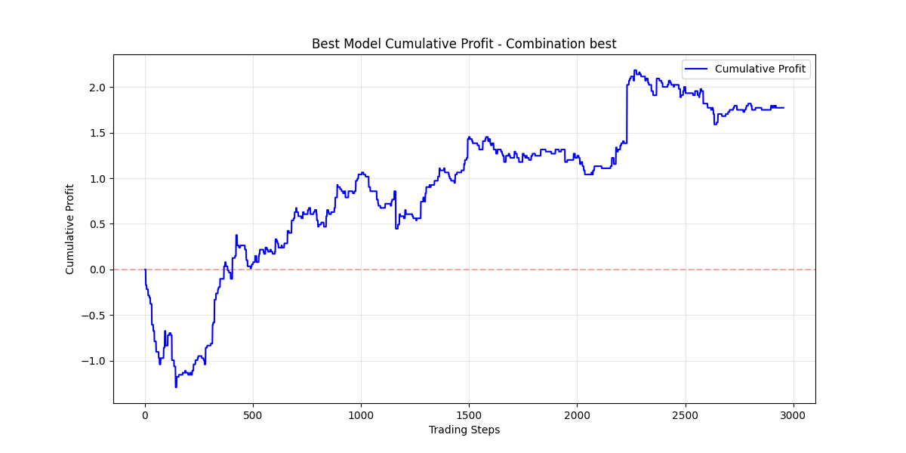

# SURFING STOCK

<div>
  <p align="center">
     
  </p>
</div>

**Surfing Stock** is an application that utilizes Reinforcement Learning to predict and execute stock trades. The goal of the project is to build a model capable of learning from historical data and optimizing trading strategies to maximize profit.


## Table of Contents
- [Overview](#overview)
- [Data Analysis](#data-analysis)
- [Model Architecture](#model-architecture)
- [Training Pipeline](#training-pipeline)
- [Evaluation Results](#evaluation-results)
- [Installation and Usage](#installation-and-usage)
- [License](#license)
- [Contact](#contact)

## Overview

The application implements a sophisticated trading system using Reinforcement Learning (PPO) with these key features:
- Automated data collection using VNStock API
- Comprehensive technical indicator generation
- Feature combination search for optimal model performance
- Multi-stage evaluation pipeline (Train → Validate → Test)

## Data Analysis

### Sample Data
Here's a sample of the stock data (FPT.csv):
```csv
time,open,high,low,close,volume
9/11/2023 9:15,98.7,99.5,98.4,98.5,356300
9/11/2023 9:20,98.5,98.5,98.2,98.3,74200
9/11/2023 9:25,98.2,98.2,97.7,97.9,117400
9/11/2023 9:30,98,98.1,97.8,97.8,94700
9/11/2023 9:35,98,98,97.9,97.9,30200
```

### Seasonal Analysis
<div>
  <p align="center">
    
    <br>
    <em>Seasonal Decomposition of FPT Stock Price</em>
  </p>
</div>

The seasonal analysis reveals:
- Clear daily trading patterns
- Weekly cycles in trading volume
- Strong trend component indicating overall market direction
- Residual noise that requires filtering

### Periodogram Analysis
<div>
  <p align="center">
    
    <br>
    <em>Periodogram Analysis for Window Selection</em>
  </p>
</div>

Based on the periodogram analysis, we identified significant frequencies that correspond to these optimal window sizes:
```python
windows = [419, 503, 559, 629, 839, 1007, 1258, 1678]
```

These windows were selected because:
- They capture both short-term and long-term price movements
- Correspond to natural market cycles (daily, weekly, monthly patterns)
- Show strong power spectral density in the periodogram

## Model Architecture

### Trading Environment
- **Type**: Custom OpenAI Gym environment
- **State Space**: Technical indicators and price data
- **Action Space**: Continuous [-1, 1] representing sell/hold/buy
- **Reward Function**: 
  - Trade profit/loss when position is closed
  - Price change when holding position
  - Transaction fees included

### PPO Implementation
- **Policy Network**: Actor-Critic architecture
- **Features**:
  - Advantage estimation
  - Policy clipping
  - Value function learning
  - Entropy bonus for exploration

### Action Interpretation
- Action > 0.1: Buy signal
- Action < -0.1: Sell signal
- Otherwise: Hold position

## Training Pipeline

### Feature Selection Process
1. **Feature Generation**:
   - Generate all technical indicators
   - Create feature combinations of specified dimension
   - Limit combinations to manage computational resources

2. **Model Training**:
   - Train separate models for each feature combination
   - Track validation metrics (F1-score, Accuracy)
   - Save checkpoints for best performing models

3. **Model Selection**:
   - Select best model based on validation metrics
   - Evaluate final performance on test set
   - Save both "last" and "best" model states

### Training Parameters
```python
{
    'learning_rate': 0.0003,
    'gamma': 0.99,
    'epsilon': 0.2,
    'epochs': 10,
    'batch_size': 64
}
```

## Evaluation Results

### Training Progress
<div>
  <p align="center">
    
    
    <br>
    <em>Validation Accuracy and F1-Score During Training</em>
  </p>
</div>

### Trading Performance
<div>
  <p align="center">
    
    <br>
    <em>Cumulative Profit Over Test Period</em>
  </p>
</div>

### Best Model Performance
- **Feature Set**: ['low', 'SMA_419', 'MACD_1007', 'STOCH_2516', 'BB_upper_1678']
- **Test Metrics**:
  - Accuracy: 52.45%
  - F1 Score: 0.5857
  - Win Rate: 12.15%
  - Sharpe Ratio: 0.01
  - Total Profit: +0.94 (+94% return)

The model shows promising results with:
- Consistent positive returns over the test period
- Stable accuracy and F1-score metrics
- Effective feature selection combining different technical indicators
- Risk-adjusted returns as measured by Sharpe Ratio

## Installation and Usage

### Requirements
- Python 3.8+
- Dependencies listed in `environment.yml`

### Installation Steps
```bash
# Clone repository
git clone https://github.com/Zeres-Engel/Reinforcement-Surfing-Stock.git
cd Reinforcement-Surfing-Stock

# Create and activate environment
conda env create -f environment.yml
conda activate surfing-stock

# Run training
python main.py --config configs/FPT.yaml
```

### Configuration
Modify `configs/FPT.yaml` to adjust:
- Training parameters
- Feature dimensions
- Data date ranges
- Model architecture

## License
This project is licensed under the MIT License - see the [LICENSE](LICENSE) file for details.

## Contact
- Email: [ngpthanh15@gmail.com](mailto:ngpthanh15@gmail.com)
- GitHub: [Zeres-Engel](https://github.com/Zeres-Engel)
